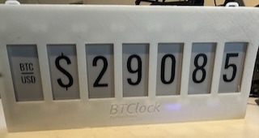
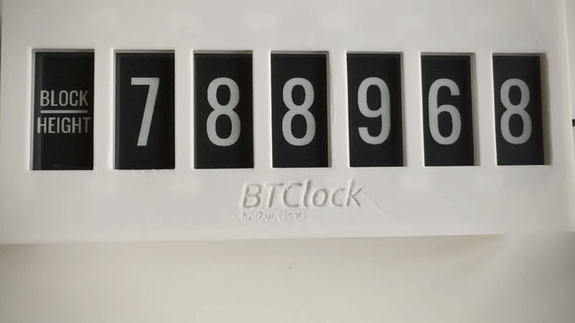
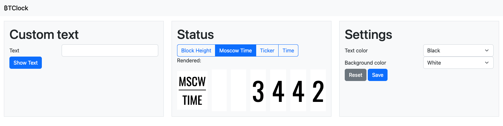
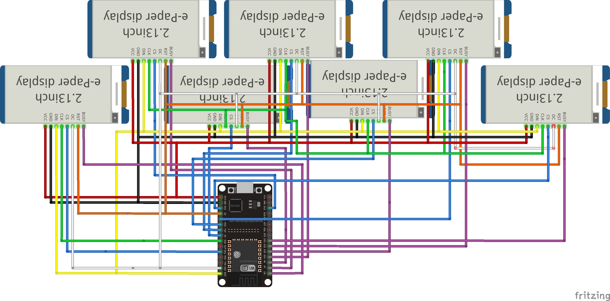

# ₿TClock

(BTClock with custom font - Antonio SemiBold)

**NOTE**: C++ is not a language I'm experienced in. The quality of the code is probably bad and makes experienced C++ developers cry. For me it works, I do hope people will help making the code better through pull requests.

[V2 of the code](https://github.com/dsbaars/btclock_v2), to be used with a custom made PCB.

What you need to build this is:

- 7x 2.13 b/w eInk screens (the b/w/r don't have fast partial refresh, it should work but it's really slow).
- MCU (For this project you need an ESP32 with 4 MB Flash) 
ESP32 S2 (like the Wemos S2 mini) does not have enough RAM, only the ESP32 and ESP32 S3 are tested and working. The ESP32 C6 only has one core and there is not recommended.
- 3D Printer to print the [case](https://www.thingiverse.com/thing:6009628)
- Soldering Iron (to solder the header pins)
- Some dupont wires are handy, but if you chain them using the 2x8 pin headers you don't necessarily need them.

This project has been developed and tested with Platform.IO. Don't forget to build the filesystem image and upload it to be able to use the web interface.

## Features

- Screens:
  - Block Height
  - Moscow Time
  - Ticker
  - Time
- API for Custom Text
- Web interface
- OTA update mechanism

## License

Apache 2.0. 

The popular font [Steelfish Rounded](https://typodermicfonts.com/steelfish-rounded/) is not directly compatible and therefore not included, you can download it yourself for personal use for free, and convert it using [fontconvert](https://github.com/adafruit/Adafruit-GFX-Library/tree/master/fontconvert) to use in this project.

By default [Oswald](https://github.com/googlefonts/OswaldFont) is used.

## Hardware

### Shared pins

| Description | Pin | Wire color |
| --------- | -- | ----- |
| SCL(SCK) | 18 | Green |
| SDA(MOSI)| 23 | Yellow |
| RST | 2 | Orange |
| DC | 22 | White|

### Per screen

CS wire is blue, BUSY is purple.

| Screen # | CS | BUSY |
| --------- | -- | ----- |
| 1 | 21 | 36 |
| 2 | 13 | 39 |
| 3 | 5 | 34 |
| 4 | 17 | 35 |
| 5 | 16 | 32 |
| 6 | 4 | 33 |
| 7 | 15 | 25 |

#### Wiring with DOIT ESP32 DevKit

